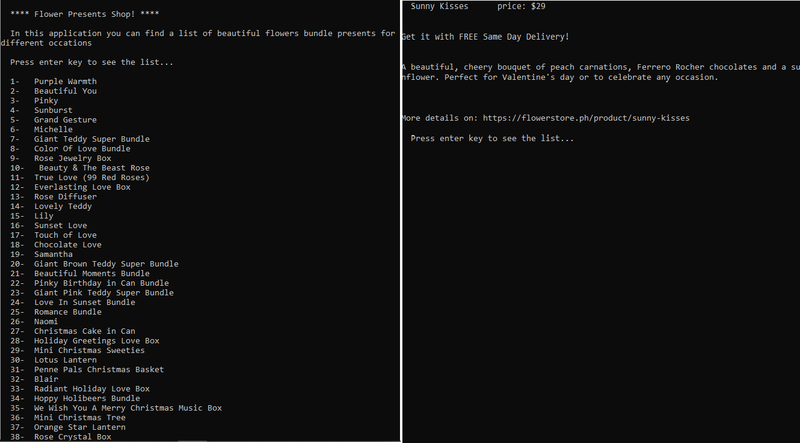

# Flower Presents Scraper
 This ruby application displays flower presents options and promptes the user to pick an option by entering a number to see a brief description and the price of the option

## Screenshot

## :hammer: Built With
* Ruby
* Nokogiri
* Robocop
* RSpec
* Atom

## Instructions 
* Clone this repository to your local drive
* Open your CLI
* Navigate to the cloned folder
* Type in: Ruby bin/main.rb
* Follow the instructions on the application

##  :bust_in_silhouette: Worked on this challenge:
# Rayan Rassam
* Github:[@Rayan84](https://github.com/Rayan84)
* Twitter:[@Rayan65096267](https://twitter.com/Rayan65096267)
* LinkedIn:[@rayan rassam](https://www.linkedin.com/in/rayan-rassam-18a0a426/)

## Credits
This project was built as per Microverse Main Technical Curriculum - Ruby section, Capstone Project requirement

## Contribution
Contributions, feedback and feature requests are welcome!
Feel free to check the [Issue](https://github.com/Rayan84/job-scraper/issues) and help me improve!
